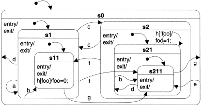

# Samek example FSM

This FSM implementation follows the TestFSM documented [here](https://accu.org/index.php/journals/252).

The state diagram can be seen below. .

Given the implementation, the specified input should yield the following results:

```
->S0;->S1;->S11;
Enter text: (type a)
<-S11;<-S1;
EventA;
->S1;->S11;
Enter text: (type e)
<-S11;<-S1;<-S0;
EventE
->S0;->S2;->S21;->S211;
Enter text: (type e)
<-S211;<-S21;<-S2;<-S0;
EventE
->S0;->S2;->S21;->S211;
Enter text: (type a)

Enter text: (type h)
<-S211;<-S21;
EventH
->S21;->S211;

Signal<-h
Signal<-x
```