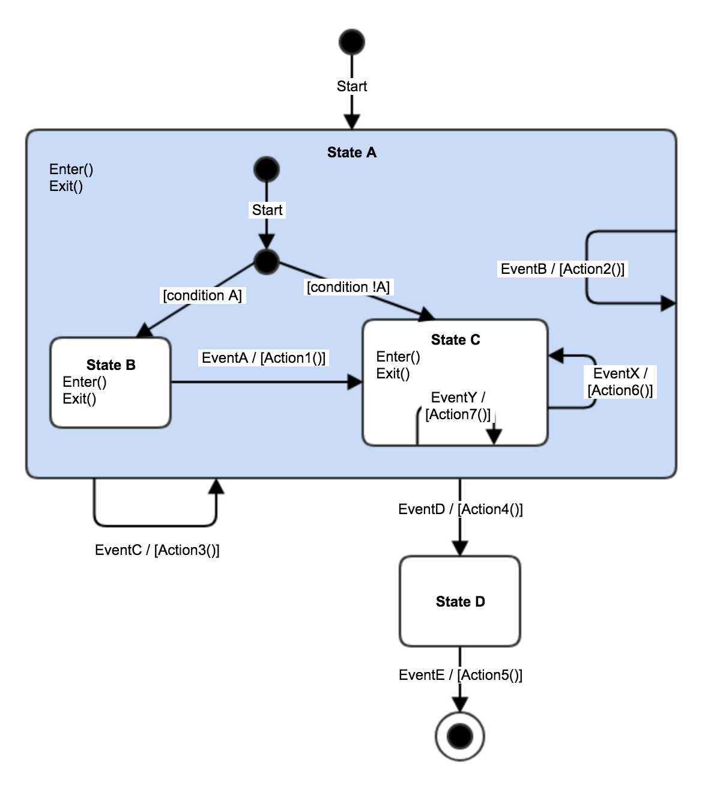

# Simple example of a HSM

This demonstrates a simple HSM. The state diagram can be seen below. .

Given the implementation, the specified input should yield the following results:

```
->A;->B;
Enter Text: (type a)
<-B;
Action1
->C;
Enter text: (type b)
Action2

Enter text: (type c)
<-C;<-A;
Action3
->A;->B;

Enter text: (type a)
<-B;
Action1
->C;

Enter text: (type x)
<-C;
Action6
->C;

Enter text: (type y)
Action7

Enter text: (type d)
<-C;<-A;
Action4
->D;

Enter text: (type e)
<-D;
Action5
Done
```